# Cách khởi tạo dự án Laravel

## 1. Tạo project Laravel

- 1.1 Vào folder muốn tạo dự án, mở CMD lên và gõ

    ```text
        laravel new
    ```

    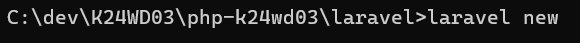

- 1.2 Sau đó đặt tên cho dự án của bạn, ví dụ:

    ```text
        my-laravel-app-test
    ```

    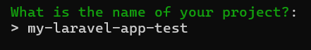

- 1.3 Khi chương trình hỏi bạn muốn cài kit nào thì chọn React

    ```text
        react
    ```

    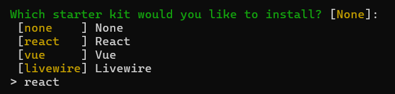

- 1.4 Sau đó chọn None

    ```text
        none
    ```

    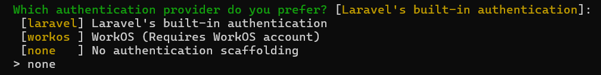

- 1.5 Chọn 1 để dùng framework của PHP

    ```text
        1
    ```

    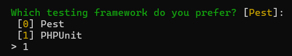

- 1.6 Chương trình sẽ hỏi, bạn muốn cài và build vite không thì chọn Yes
    ```text
        yes
    ```
    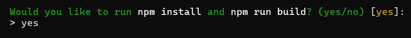

---

## 2. Cách chạy project

- cd vào project mới tạo:
    ```text
        cd my-laravel-app-test
    ```
- Sau đó, chạy project bằng lệnh:
    ```text
        composer run dev
    ```

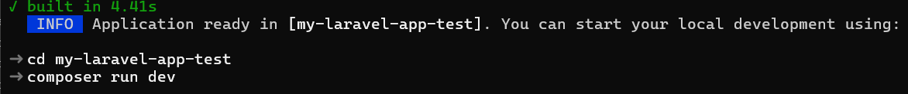

---

## 3. Cách setup các thư mục

- Tìm file .env, và làm như ảnh:
  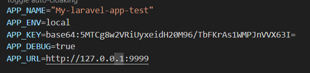
  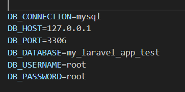

- Tìm file composer.json, sau đó Ctrl + F tìm "php artisan serve" và thêm:

    ```text
        --port=9999
    ```

    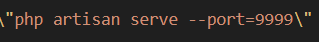

- Tìm theo đường dẫn ./resources/js trong đây sẽ có 2 file là app.jsx và ssr.jsx:
    - File app.tsx dòng 11 và ssr.tsx dòng 14 sửa extension thành .jsx
      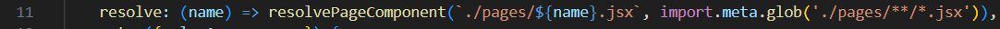
      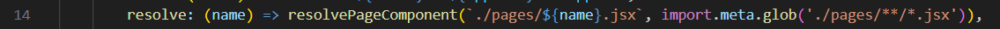

- Tìm theo đường dẫn ./resources/views mở file app.blade.php:
    - Chỉ sửa extension ở CUỐI thành .jsx
      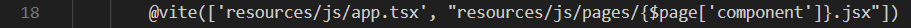


- Cách cấu hình cơ sở dữ liệu:

    ```text
        php artisan migrate
    ```

- Cách tạo controller và model:
    - Controller:

    ```text
        php artisan make:controller TenController
    ```

    - Model:

    ```text
        php artisan make:model TenModel
    ```
